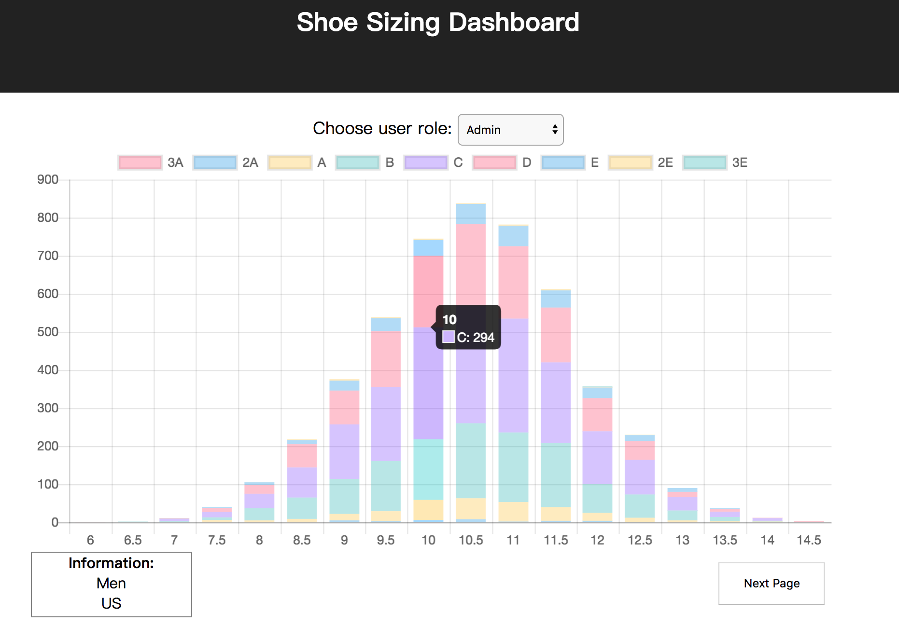

## Data Dashboard for Shoe Sizes

#### Ke Wang

### How to run

```
cd shoe-sizes-vis
npm install
npm start
```
App now can be viewed at localhost:3000.

### App Design

This app is built on React.js and Chart.js. D3.js can also be an option for this exercise, but it then will take much longer time to draw the chart. So I chose Chart.js.

The app has three parts: a user role selecter, a dynamic stacked bar chart with source and gender information, and a 'next page' button. 

I don't have 100% confidence that I handled REST API pagination correctly, but I tried to present that page continuation tokens are passed when sending the query, and the chart could be rerendered during the process.

### Potential Improvements

If I have more free time, I would like to refactor the code, it can be cleaner and easier to read.

### Screenshot


